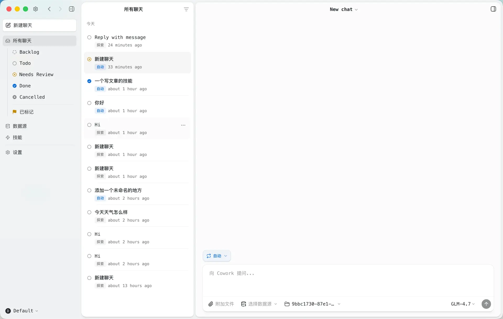

# 搭子（Dazi）

[](LICENSE)
[](CODE_OF_CONDUCT.md)
[](https://www.aicowork.chat)

Dazi is a powerful desktop application for working effectively with AI agents. It enables intuitive multitasking, seamless connection to any API or Service, session sharing, and a more document-centric workflow - in a beautiful and fluid UI.

Built on top of Claude Agent SDK, Dazi brings the power of Claude to a native desktop experience with advanced features like multi-session management, permission controls, and extensible source connections.

**Key Highlights:**
- 🖥️ Native desktop app with beautiful UI
- 🔄 Multi-session inbox with status workflow
- 🔌 Connect to MCP servers, REST APIs, and local files
- 🛡️ Three-level permission system (Explore / Ask / Auto)
- 🎨 Customizable themes and workspaces
- 📦 Skills system for specialized agent instructions

Dazi is open source under the Apache 2.0 license. Visit [aicowork.chat](https://www.aicowork.chat) for more information.



## Installation

### Download

Visit [aicowork.chat](https://www.aicowork.chat) to download the latest version for your platform.

### Build from Source

```bash
git clone https://github.com/zhangtuansia/agent-operator.git
cd agent-operator
bun install
bun run electron:start
```

## Features

- **Multi-Session Inbox**: Desktop app with session management, status workflow, and flagging
- **Streaming Responses**: Real-time tool visualization and progress updates
- **Sources**: Connect to MCP servers, REST APIs (Google, Slack, Microsoft), and local filesystems
- **Permission Modes**: Three-level system (Explore, Ask to Edit, Auto) with customizable rules
- **Background Tasks**: Run long-running operations with progress tracking
- **Dynamic Status System**: Customizable session workflow states (Todo, In Progress, Done, etc.)
- **Theme System**: Cascading themes at app and workspace levels
- **Multi-File Diff**: VS Code-style window for viewing all file changes in a turn
- **Skills**: Specialized agent instructions stored per-workspace ([Skills Market](https://www.aicowork.chat/skills))
- **File Attachments**: Drag-drop images, PDFs, Office documents with auto-conversion
- **i18n Support**: English and Chinese language support

## Quick Start

1. **Launch the app** after installation
2. **Choose billing**: Use your own Anthropic API key or Claude Max subscription
3. **Create a workspace**: Set up a workspace to organize your sessions
4. **Connect sources** (optional): Add MCP servers, REST APIs, or local filesystems
5. **Start chatting**: Create sessions and interact with Claude

## Desktop App Features

### Session Management

- **Inbox/Archive**: Sessions organized by workflow status
- **Flagging**: Mark important sessions for quick access
- **Status Workflow**: Todo → In Progress → Needs Review → Done
- **Session Naming**: AI-generated titles or manual naming
- **Session Persistence**: Full conversation history saved to disk

### Sources

Connect external data sources to your workspace:

| Type | Examples |
|------|----------|
| **MCP Servers** | Linear, GitHub, Notion, and any custom MCP servers |
| **REST APIs** | Google (Gmail, Calendar, Drive), Slack, Microsoft |
| **Local Files** | Filesystem, Obsidian vaults, Git repos |

### Permission Modes

| Mode | Display | Behavior |
|------|---------|----------|
| `safe` | Explore | Read-only, blocks all write operations |
| `ask` | Ask to Edit | Prompts for approval (default) |
| `allow-all` | Auto | Auto-approves all commands |

Use **SHIFT+TAB** to cycle through modes in the chat interface.

### Keyboard Shortcuts

| Shortcut | Action |
|----------|--------|
| `Cmd+N` | New chat |
| `Cmd+1/2/3` | Focus sidebar/list/chat |
| `Cmd+,` | Open settings |
| `Cmd+B` | Toggle sidebar |
| `SHIFT+TAB` | Cycle permission modes |
| `Cmd+Enter` | Send message |
| `Enter` | New line |
| `Esc` | Interrupt agent |

## Architecture

```
agent-operator/
├── apps/
│   └── electron/              # Desktop GUI (primary)
│       └── src/
│           ├── main/          # Electron main process
│           ├── preload/       # Context bridge
│           └── renderer/      # React UI (Vite + shadcn)
└── packages/
    ├── core/                  # Shared types
    └── shared/                # Business logic
        └── src/
            ├── agent/         # OperatorAgent, permissions
            ├── auth/          # OAuth, tokens
            ├── config/        # Storage, preferences, themes
            ├── credentials/   # AES-256-GCM encrypted storage
            ├── sessions/      # Session persistence
            ├── sources/       # MCP, API, local sources
            └── statuses/      # Dynamic status system
```

## Development

```bash
# Hot reload development
bun run electron:dev

# Build and run
bun run electron:start

# Type checking
bun run typecheck:all

# Debug logging (writes to ~/Library/Logs/Dazi/)
# Logs are automatically enabled in development
```

### Environment Variables

OAuth integrations (Google, Slack, Microsoft) require credentials. Create a `.env` file:

```bash
MICROSOFT_OAUTH_CLIENT_ID=your-client-id
GOOGLE_OAUTH_CLIENT_SECRET=your-google-client-secret
GOOGLE_OAUTH_CLIENT_ID=your-client-id.apps.googleusercontent.com
SLACK_OAUTH_CLIENT_ID=your-slack-client-id
SLACK_OAUTH_CLIENT_SECRET=your-slack-client-secret
```

See [Google Cloud Console](https://console.cloud.google.com/apis/credentials) to create OAuth credentials.

## Configuration

Configuration is stored at `~/.cowork/`:

```
~/.cowork/
├── config.json              # Main config (workspaces, auth type)
├── credentials.enc          # Encrypted credentials (AES-256-GCM)
├── preferences.json         # User preferences
├── theme.json               # App-level theme
└── workspaces/
    └── {id}/
        ├── config.json      # Workspace settings
        ├── theme.json       # Workspace theme override
        ├── sessions/        # Session data (JSONL)
        ├── sources/         # Connected sources
        ├── skills/          # Custom skills
        └── statuses/        # Status configuration
```

## Advanced Features

### Large Response Handling

Tool responses exceeding ~60KB are automatically summarized using Claude Haiku with intent-aware context. The `_intent` field is injected into MCP tool schemas to preserve summarization focus.

### Deep Linking

External apps can navigate using `agentoperator://` URLs:

```
agentoperator://allChats                    # All chats view
agentoperator://allChats/chat/session123    # Specific chat
agentoperator://settings                    # Settings
agentoperator://sources/source/github       # Source info
agentoperator://action/new-chat             # Create new chat
```

## Tech Stack

| Layer | Technology |
|-------|------------|
| Runtime | [Bun](https://bun.sh/) |
| AI | [@anthropic-ai/claude-agent-sdk](https://www.npmjs.com/package/@anthropic-ai/claude-agent-sdk) |
| Desktop | [Electron](https://www.electronjs.org/) + React |
| UI | [shadcn/ui](https://ui.shadcn.com/) + Tailwind CSS v4 |
| Build | esbuild (main) + Vite (renderer) |
| Credentials | AES-256-GCM encrypted file storage |

## License

This project is licensed under the Apache License 2.0 - see the [LICENSE](LICENSE) file for details.

### Third-Party Licenses

This project uses the [Claude Agent SDK](https://www.npmjs.com/package/@anthropic-ai/claude-agent-sdk), which is subject to [Anthropic's Commercial Terms of Service](https://www.anthropic.com/legal/commercial-terms).

### Trademark

"Dazi" and "搭子" are trademarks. See [TRADEMARK.md](TRADEMARK.md) for usage guidelines.

## Contributing

We welcome contributions! Please see [CONTRIBUTING.md](CONTRIBUTING.md) for guidelines.

## Security

### Local MCP Server Isolation

When spawning local MCP servers (stdio transport), sensitive environment variables are filtered out to prevent credential leakage to subprocesses. Blocked variables include:

- `ANTHROPIC_API_KEY`, `CLAUDE_CODE_OAUTH_TOKEN` (app auth)
- `AWS_ACCESS_KEY_ID`, `AWS_SECRET_ACCESS_KEY`, `AWS_SESSION_TOKEN`
- `GITHUB_TOKEN`, `GH_TOKEN`, `OPENAI_API_KEY`, `GOOGLE_API_KEY`, `STRIPE_SECRET_KEY`, `NPM_TOKEN`

To explicitly pass an env var to a specific MCP server, use the `env` field in the source config.

To report security vulnerabilities, please see [SECURITY.md](SECURITY.md).
