# Mermaid Diagram Syntax Reference

Craft Agent renders Mermaid diagrams natively as beautiful themed SVGs. Use this reference for syntax details.

## Flowcharts

**Header:** `graph LR` (left-right, preferred) or `graph TD` (top-down)
**Directions:** LR (preferred), RL, TD, TB, BT

### Node Shapes

| Syntax | Shape |
|--------|-------|
| `A[text]` | Rectangle |
| `A(text)` | Rounded rectangle |
| `A{text}` | Diamond (decision) |
| `A([text])` | Stadium |
| `A((text))` | Circle |
| `A[[text]]` | Subroutine |
| `A[(text)]` | Cylinder (database) |
| `A{{text}}` | Hexagon |
| `A>text]` | Asymmetric flag |
| `A[/text\]` | Trapezoid |
| `A[\text/]` | Trapezoid (alt) |
| `A(((text)))` | Double circle |

### Arrow Types

| Syntax | Style |
|--------|-------|
| `-->` | Solid arrow |
| `---` | Solid line (no arrow) |
| `-.->` | Dotted arrow |
| `-.-` | Dotted line |
| `==>` | Thick arrow |
| `===` | Thick line |
| `<-->` | Bidirectional solid |
| `<-.->` | Bidirectional dotted |
| `<==>` | Bidirectional thick |

### Edge Labels

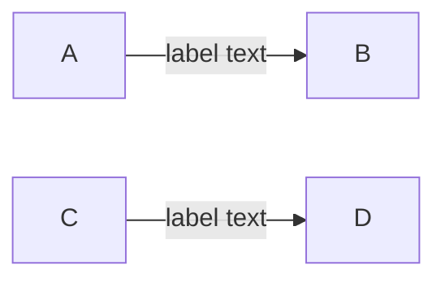

### Subgraphs

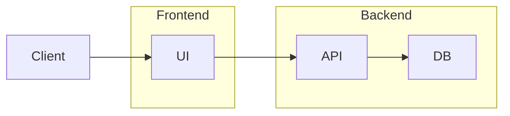

### Subgraph with ID

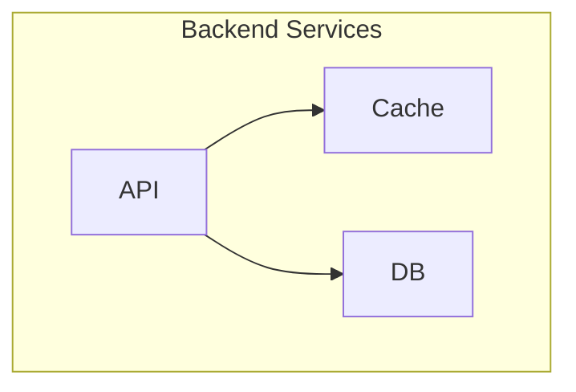

### Styling

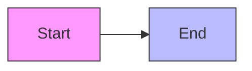

### Chained Edges

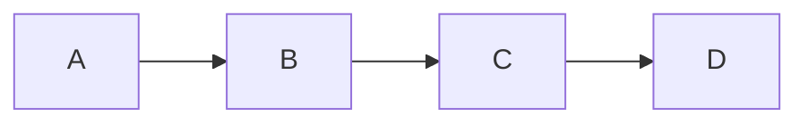

### Parallel Links

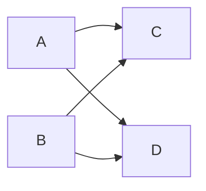

## State Diagrams

**Header:** `stateDiagram-v2`

### Basic States

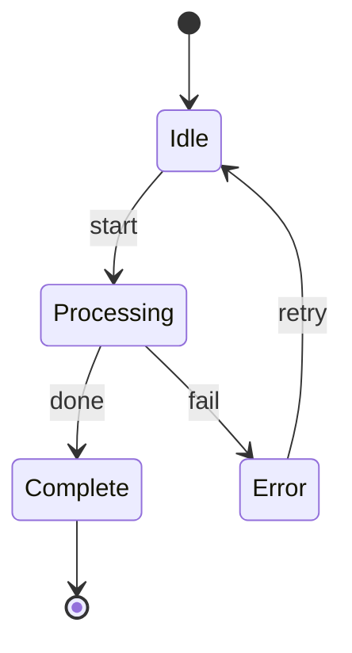

### State Descriptions

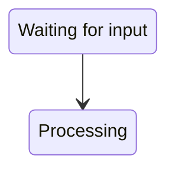

### Composite States

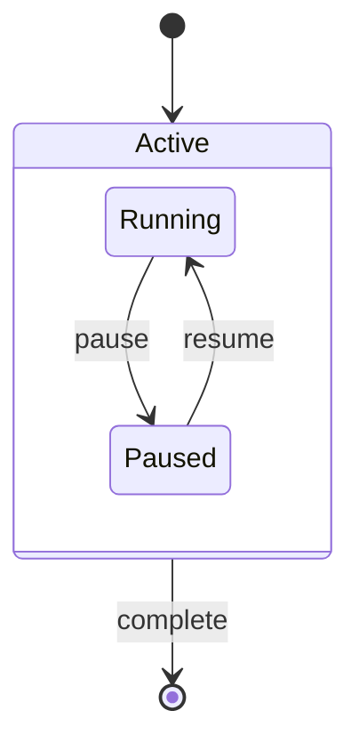

### Direction Override

```mermaid
stateDiagram-v2
    direction LR
    [*] --> A --> B --> [*]
```

## Sequence Diagrams

**Header:** `sequenceDiagram`

### Message Types

| Syntax | Meaning |
|--------|---------|
| `->>` | Solid line, solid arrowhead |
| `-->>` | Dotted line, solid arrowhead |
| `-)` | Solid line, open arrowhead (async) |
| `--)` | Dotted line, open arrowhead |
| `-x` | Solid line with X (lost message) |
| `--x` | Dotted line with X |

### Participants

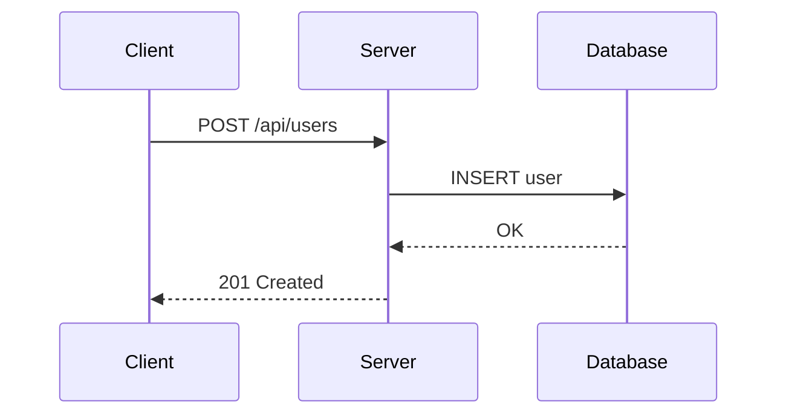

### Activations

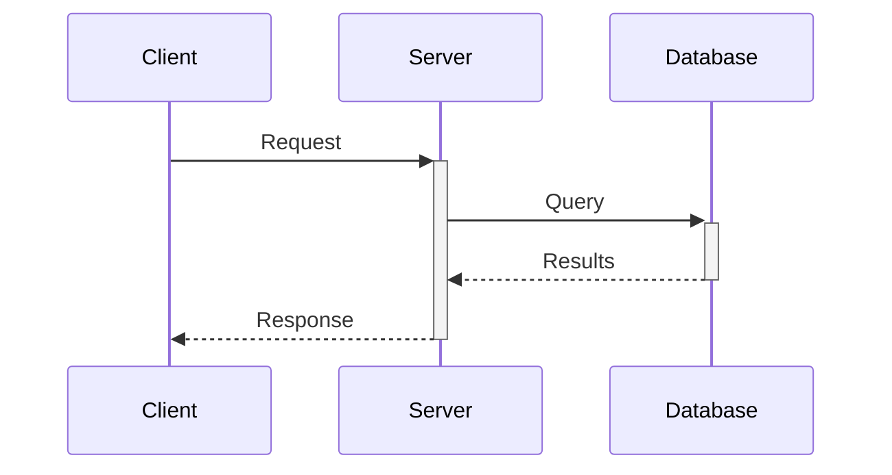

### Notes

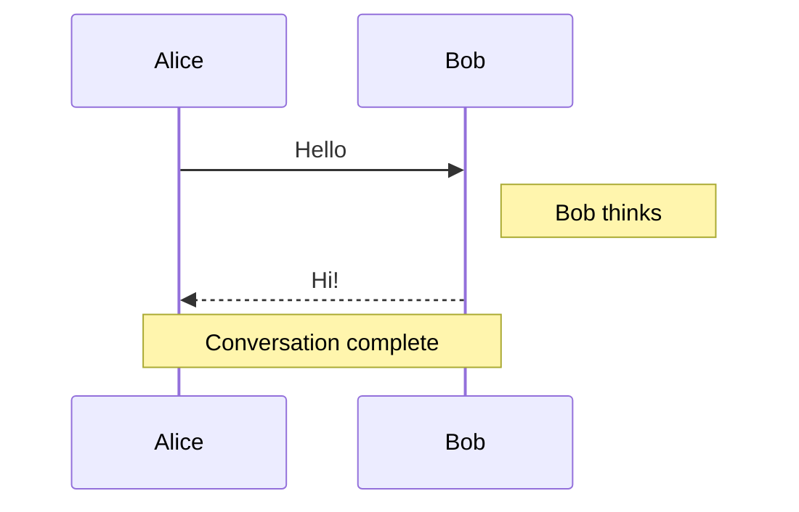

### Loops

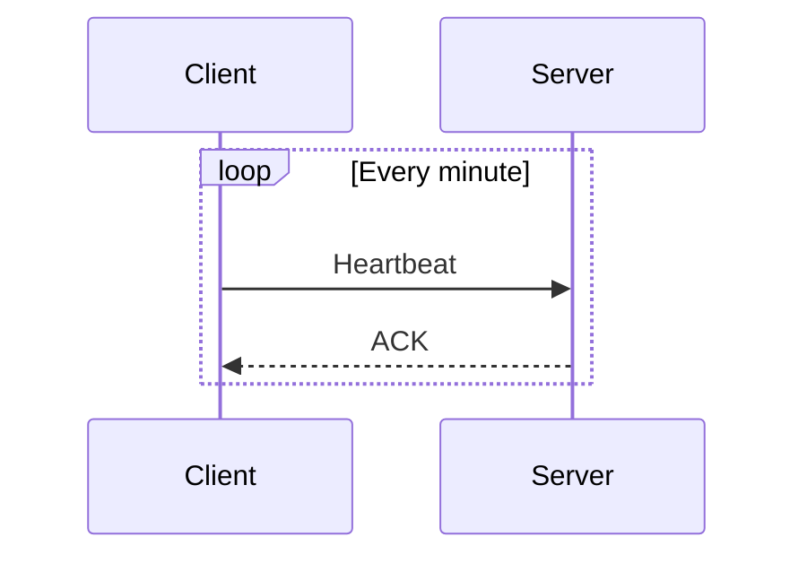

### Alternatives

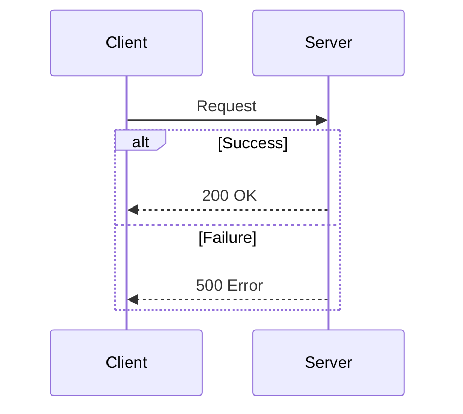

### Optional

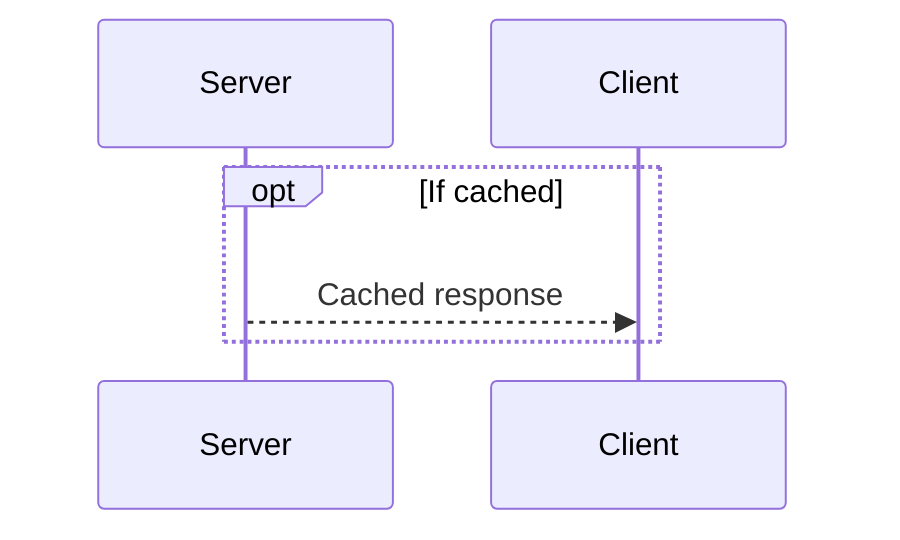

### Parallel

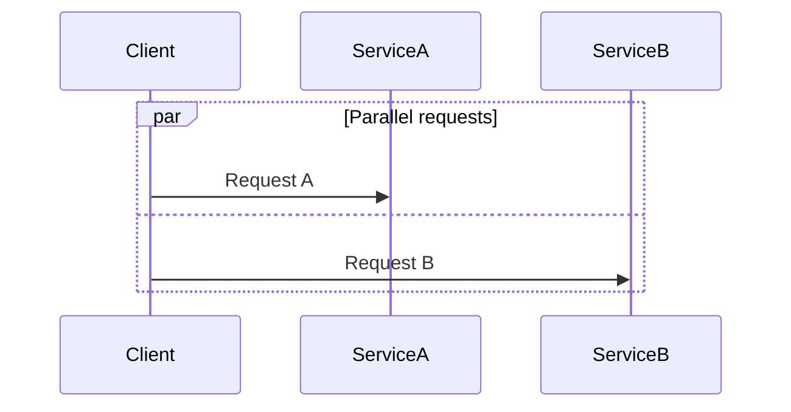

## Class Diagrams

**Header:** `classDiagram`

### Classes with Members

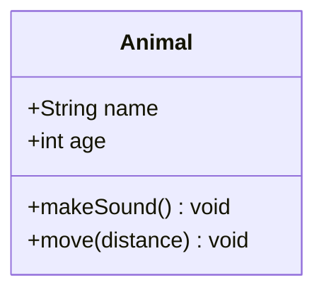

### Visibility Modifiers

| Symbol | Meaning |
|--------|---------|
| `+` | Public |
| `-` | Private |
| `#` | Protected |
| `~` | Package/Internal |

### Relationships

| Syntax | Meaning |
|--------|---------|
| `<\|--` | Inheritance (extends) |
| `*--` | Composition (contains) |
| `o--` | Aggregation (has) |
| `-->` | Association |
| `..>` | Dependency |
| `..\|>` | Realization (implements) |
| `--` | Link (solid) |
| `..` | Link (dashed) |

### Cardinality

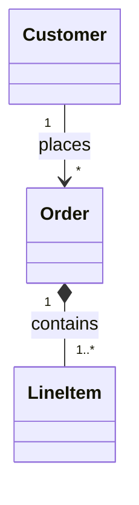

### Full Example

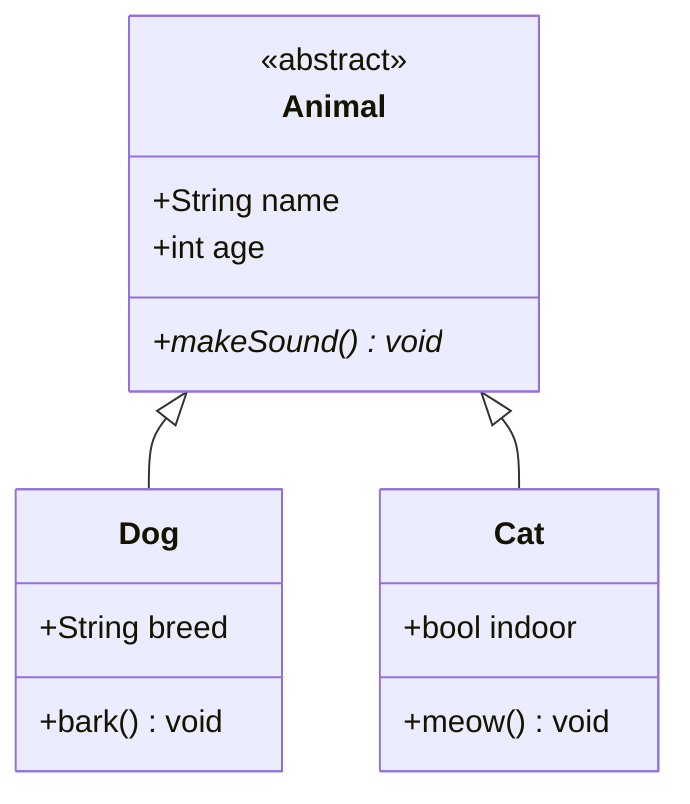

### Annotations

```mermaid
classDiagram
    class Service {
        <<interface>>
        +start() void
        +stop() void
    }

    class Logger {
        <<singleton>>
        -instance Logger
        +log(msg) void
    }
```

## ER Diagrams

**Header:** `erDiagram`

### Basic Relationships

```mermaid
erDiagram
    USER ||--o{ ORDER : places
    ORDER ||--|{ LINE_ITEM : contains
    PRODUCT ||--o{ LINE_ITEM : "is in"
```

### Cardinality Notation

| Left | Right | Meaning |
|------|-------|---------|
| `\|\|` | `\|\|` | Exactly one to exactly one |
| `\|\|` | `o\|` | Exactly one to zero or one |
| `\|\|` | `o{` | Exactly one to zero or more |
| `\|\|` | `\|{` | Exactly one to one or more |
| `o\|` | `o\|` | Zero or one to zero or one |
| `o\|` | `o{` | Zero or one to zero or more |
| `o{` | `o{` | Zero or more to zero or more |

### Entity Attributes

```mermaid
erDiagram
    USER {
        int id PK
        string email UK
        string name
        datetime created_at
    }

    ORDER {
        int id PK
        int user_id FK
        decimal total
        date created_at
    }

    USER ||--o{ ORDER : places
```

### Attribute Types

Common attribute markers:
- `PK` - Primary Key
- `FK` - Foreign Key
- `UK` - Unique Key

### Full Example

```mermaid
erDiagram
    CUSTOMER {
        int id PK
        string email UK
        string name
        string phone
    }

    ORDER {
        int id PK
        int customer_id FK
        date order_date
        string status
    }

    PRODUCT {
        int id PK
        string name
        decimal price
        int stock
    }

    LINE_ITEM {
        int id PK
        int order_id FK
        int product_id FK
        int quantity
        decimal unit_price
    }

    CUSTOMER ||--o{ ORDER : places
    ORDER ||--|{ LINE_ITEM : contains
    PRODUCT ||--o{ LINE_ITEM : "included in"
```

## Best Practices

### Prefer Horizontal (Landscape) Orientations

**IMPORTANT**: Use horizontal layouts (LR, RL) whenever possible. Horizontal diagrams are much easier to view and navigate in the UI.

- **Flowcharts**: Use `graph LR` (left-right) instead of `graph TD` (top-down)
- **State Diagrams**: Add `direction LR` after the header
- **Sequence Diagrams**: Naturally horizontal, no changes needed
- **Class Diagrams**: For wide hierarchies, consider splitting into multiple horizontal diagrams
- **ER Diagrams**: Naturally horizontal, no changes needed

**Only use vertical layouts (TD, BT) when**:
- The diagram is inherently hierarchical (org charts, tree structures)
- The vertical layout is significantly clearer than horizontal
- The diagram has very few nodes (3-4 max)

### Keep Diagrams Focused

One concept per diagram. If a diagram gets complex, split it into multiple diagrams.

### Use Descriptive Labels

```mermaid
graph LR
    A[User submits form] --> B{Validation}
    B -->|Valid| C[Save to database]
    B -->|Invalid| D[Show errors]
```

### Choose the Right Direction

**Horizontal (preferred)**:
- **LR (left-right)**: DEFAULT - Use for flows, pipelines, state machines, processes, and most diagrams
- **RL (right-left)**: Reverse flows (when semantically meaningful)

**Vertical (use sparingly)**:
- **TD (top-down)**: Only for hierarchies, inheritance, org charts where vertical structure is essential
- **BT (bottom-top)**: Only for dependencies pointing upward

### Validate Complex Diagrams

Use the `mermaid_validate` tool to check syntax before outputting complex diagrams:

```
mermaid_validate({ code: "graph TD\n  A --> B" })
```

## Troubleshooting

### Common Errors

1. **Missing direction**: Always include direction in flowcharts (`graph TD`, not just `graph`)
2. **Unbalanced brackets**: Ensure all `[`, `(`, `{` are properly closed
3. **Special characters in labels**: Use quotes for labels with special characters
4. **Invalid arrow syntax**: Check the arrow type table above

### Escaping Special Characters

For labels with special characters, wrap in quotes:

```mermaid
graph LR
    A["Label with (parentheses)"] --> B["Label with [brackets]"]
```
